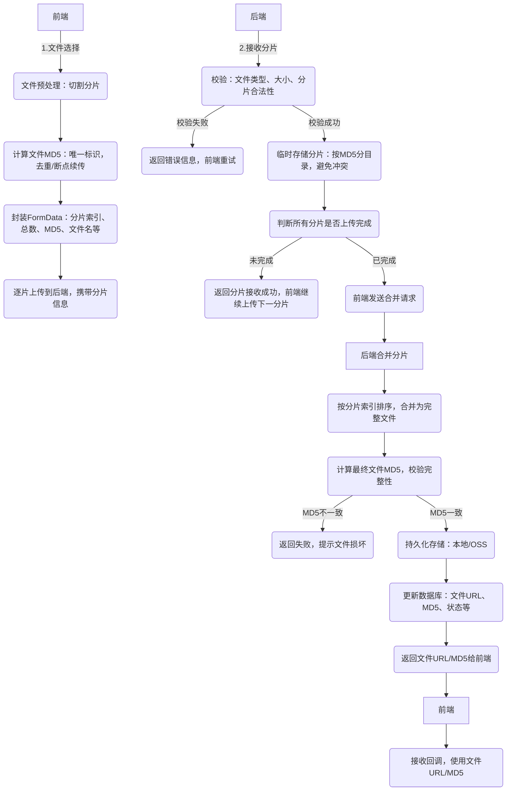

在日常开发中，文件上传是一个非常常见的需求，但当面对几十MB、几百MB甚至GB级别的大文件时，直接一次性上传会面临诸多问题：请求超时、服务器内存溢出、网络中断后需重新上传、进度无法跟踪等。而分片上传技术，正是解决这些问题的最优方案之一。

本文将从实际开发场景出发，手把手带你实现一套「前端分片切割、后端接收校验、合并持久化、入库回调」的完整大文件分片上传流程，涵盖前后端核心代码、关键细节、避坑指南，新手也能直接上手复用。

## 一、前言：为什么需要分片上传？

在讲解实现之前，我们先明确「大文件直接上传」的痛点，以及分片上传的核心优势，帮你理解这套方案的必要性：

- **请求超时**：大文件上传耗时久，超过服务器默认超时时间（通常30s），会导致上传失败；

- **内存压力**：后端一次性接收大文件，会占用大量内存，甚至引发OOM（内存溢出）；

- **重传成本高**：网络中断后，直接上传需要重新传输整个文件，浪费带宽和时间；

- **进度不可控**：无法展示上传进度，用户体验差，不知道文件是否在正常上传。

而分片上传的核心逻辑，就是将大文件切割成多个固定大小的「小分片」，逐片上传到后端，后端接收后临时存储，所有分片上传完成后，再合并成完整文件。这样既能规避上述所有痛点，还能实现断点续传、秒传等高级功能。

本文实现的核心功能清单：

- 前端：文件分片切割、文件MD5计算（唯一标识）、FormData封装、逐片上传、进度展示；

- 后端：分片接收、文件类型/大小二次校验、分片临时存储、分片合并、MD5完整性校验；

- 数据持久化：文件信息（MD5、URL、大小等）入库、合并完成后返回文件URL/MD5供前端回调；

- 避坑处理：分片冲突、合并排序、临时文件清理、MD5一致性校验。

## 二、整体流程设计（一张图看懂全链路）

在动手写代码之前，先梳理清楚前后端的交互流程，避免开发中出现逻辑混乱。整个流程分为「前端预处理与分片上传」和「后端接收与合并持久化」两大环节，如下所示：

核心流程：前端分片 → 计算MD5 → 逐片上传（带分片信息）→ 后端校验 → 临时存储 → 所有分片上传完成 → 前端请求合并 → 后端合并分片 → MD5校验 → 持久化存储 → 入库更新 → 返回URL/MD5 → 前端回调使用。

用流程图更直观展示（可直接复制到mermaid在线编辑器查看）：



## 三、前端实现（基于JavaScript/HTML，可无缝适配Vue/React）

前端核心任务：将大文件切割成固定大小的分片，计算文件MD5（用于唯一标识），封装分片信息，逐片上传，并展示上传进度。这里我们使用原生JavaScript实现，适配所有前端框架，关键代码可直接复制复用。

### 3.1 依赖准备

计算文件MD5需要用到 `spark-md5` 库（高效、轻量，比原生实现更简洁），我们直接通过CDN引入，无需本地安装：

```html
<!-- 引入spark-md5计算文件MD5 -->
<script src="https://cdn.bootcdn.net/ajax/libs/spark-md5/3.0.2/spark-md5.min.js"></script>
<!-- 页面元素：文件选择、上传按钮、进度展示 -->
<div style="margin: 20px;">
    <input type="file" id="fileInput" style="margin-bottom: 10px;" />
    <button onclick="uploadFile()" style="padding: 6px 12px; cursor: pointer;">开始上传</button>
    <div id="progress" style="margin-top: 10px; color: #333;"&gt;上传进度：0%&lt;/div&gt;
&lt;/div&gt;
```

### 3.2 核心配置与代码

定义分片大小、后端接口地址等配置，然后实现「分片切割、MD5计算、逐片上传、合并请求」四大核心功能：

```javascript
// 核心配置（可根据实际需求调整）
const config = {
    chunkSize: 1024 * 1024 * 5, // 分片大小：5MB（建议5-10MB，太大易超时，太小请求过多）
    uploadChunkUrl: "/api/upload/chunk", // 后端分片上传接口
    mergeChunkUrl: "/api/upload/merge", // 后端分片合并接口
    // token: "your-token", // 若后端需要认证，添加token（如JWT）
};

// 上传主函数（入口）
async function uploadFile() {
    const fileInput = document.getElementById("fileInput");
    const file = fileInput.files[0];
    const progressDom = document.getElementById("progress");
    
    // 校验：选择文件
    if (!file) {
        alert("请先选择需要上传的文件");
        return;
    }
    
    try {
        // 1. 计算文件MD5（唯一标识，用于分片去重、合并校验）
        progressDom.innerText = "正在计算文件MD5...";
        const fileMd5 = await calculateFileMd5(file);
        
        // 2. 切割文件为分片
        const chunks = createFileChunks(file);
        const chunkTotal = chunks.length; // 分片总数
        progressDom.innerText = `文件切割完成，共${chunkTotal}个分片，准备上传...`;
        
        // 3. 逐片上传（同步上传，避免并发请求过多压垮服务器；可优化为并发上传）
        for (let chunkIndex = 0; chunkIndex < chunkTotal; chunkIndex++) {
            const chunk = chunks[chunkIndex];
            // 封装FormData（后端接收的核心参数）
            const formData = new FormData();
            formData.append("chunk", chunk); // 分片文件流
            formData.append("chunkIndex", chunkIndex); // 当前分片索引（从0开始）
            formData.append("chunkTotal", chunkTotal); // 分片总数
            formData.append("fileMd5", fileMd5); // 文件唯一标识
            formData.append("fileName", file.name); // 原始文件名
            formData.append("fileType", file.type); // 文件类型（如image/png）
            formData.append("fileSize", file.size); // 文件总大小（字节）
            
            // 上传当前分片
            await fetch(config.uploadChunkUrl, {
                method: "POST",
                body: formData,
                headers: {
                    // 若后端需要认证，添加请求头（示例）
                    // "Authorization": `Bearer ${config.token}`
                },
                // 禁止浏览器自动设置Content-Type（FormData会自动设置）
            }).then(res => res.json()).then(data => {
                if (data.code !== 200) {
                    throw new Error(`分片${chunkIndex + 1}/${chunkTotal}上传失败：${data.msg}`);
                }
                // 更新上传进度
                const progress = ((chunkIndex + 1) / chunkTotal) * 100;
                progressDom.innerText = `上传进度：${progress.toFixed(2)}%（${chunkIndex + 1}/${chunkTotal}）`;
            });
        }
        
        // 4. 所有分片上传完成，请求后端合并文件
        progressDom.innerText = "所有分片上传完成，正在合并文件...";
        await fetch(config.mergeChunkUrl, {
            method: "POST",
            headers: {
                "Content-Type": "application/json",
                // "Authorization": `Bearer ${config.token}`
            },
            body: JSON.stringify({
                fileMd5,
                fileName: file.name,
                chunkTotal
            })
        }).then(res => res.json()).then(data => {
            if (data.code === 200) {
                progressDom.innerText = `上传成功！\n文件URL：${data.data.url}\n文件MD5：${data.data.md5}`;
                // 这里可添加前端回调逻辑（如：将URL/MD5存入表单，跳转页面等）
                console.log("文件上传完成，回调信息：", data.data);
            } else {
                throw new Error(`文件合并失败：${data.msg}`);
            }
        });
        
    } catch (error) {
        // 上传失败处理（可添加重试逻辑）
        progressDom.innerText = `上传失败：${error.message}`;
        console.error("上传异常：", error);
    }
}

/**
 * 切割文件为分片
 * @param {File} file - 原始文件
 * @returns {Array} - 分片数组
 */
function createFileChunks(file) {
    const chunks = [];
    let start = 0; // 分片起始位置
    while (start < file.size) {
        // 计算分片结束位置（最后一个分片可能小于chunkSize）
        const end = Math.min(start + config.chunkSize, file.size);
        // 切割文件（slice方法不改变原始文件，返回新的Blob对象）
        const chunk = file.slice(start, end);
        chunks.push(chunk);
        start = end; // 更新起始位置，准备下一个分片
    }
    return chunks;
}

/**
 * 计算文件MD5（异步操作）
 * @param {File} file - 原始文件
 * @returns {Promise<string>} - 文件MD5值
 */
function calculateFileMd5(file) {
    return new Promise((resolve, reject) => {
        const spark = new SparkMD5.ArrayBuffer(); // 初始化spark-md5
        const reader = new FileReader(); // 文件读取器
        
        // 读取文件为ArrayBuffer（适合大文件，效率高）
        reader.readAsArrayBuffer(file);
        
        // 读取完成回调
        reader.onload = function (e) {
            spark.append(e.target.result); // 追加文件内容
            resolve(spark.end()); // 计算完成，返回MD5值
        };
        
        // 读取失败回调
        reader.onerror = function (error) {
            reject(new Error(`MD5计算失败：${error.message}`));
        };
    });
}
```

### 3.3 前端关键细节说明

- **分片大小选择**：建议设置为5-10MB，太小会导致请求次数过多，太大易超时；可根据服务器带宽和前端网络环境调整；

- **MD5计算**：用`spark-md5`的`ArrayBuffer`方式，比`readAsBinaryString`更高效，适合大文件；

- **FormData封装**：无需手动设置`Content-Type`，浏览器会自动设置为`multipart/form-data`（后端接收分片的关键）；

- **进度展示**：通过「当前分片索引/总分片数」计算进度，直观反馈给用户；

- **优化方向**：当前是同步上传，可改为并发上传（控制并发数，如3-5个），提升上传速度；可添加断点续传（查询已上传分片，跳过重复分片）。

## 四、后端实现（基于Java/Spring Boot，易适配其他语言）

后端核心任务：接收前端上传的分片，进行二次校验（避免前端伪造数据），临时存储分片，接收合并请求后合并分片，校验文件完整性，持久化存储，更新数据库，返回文件URL/MD5供前端回调。

这里我们用Java/Spring Boot实现，代码简洁、注释详细，可直接复制复用；若你使用Python/Node.js等其他语言，核心逻辑完全一致，只需替换对应的文件操作和接口实现即可。

### 4.1 依赖准备（pom.xml）

引入核心依赖（Web、数据库、文件操作工具类）：

```xml
<!-- Spring Web（接口开发） -->
<dependency>
    <groupId>org.springframework.boot</groupId>
    <artifactId>spring-boot-starter-web</artifactId>
</dependency>

<!-- MySQL数据库（数据持久化） -->
<dependency>
    <groupId>mysql</groupId>
    <artifactId>mysql-connector-java</artifactId>
    <scope>runtime</scope>
</dependency>

<!-- MyBatis（数据库操作） -->
<dependency>
    <groupId>org.mybatis.spring.boot</groupId>
    <artifactId>mybatis-spring-boot-starter</artifactId>
    <version>2.3.0</version>
</dependency>

<!-- 文件操作工具类（Apache Commons IO） -->
<dependency>
    <groupId>commons-io</groupId>
    <artifactId>commons-io</artifactId>
    <version>2.15.0</version>
</dependency>

<!-- MD5计算工具类（Apache Commons Codec） -->
<dependency>
    <groupId>commons-codec</groupId>
    <artifactId>commons-codec</artifactId>
    <version>1.15</version>
</dependency>

<!-- Lombok（简化实体类代码） -->
<dependency>
    <groupId>org.projectlombok</groupId>
    <artifactId>lombok</artifactId>
    <optional>true</optional>
</dependency>
```

### 4.2 核心配置（application.yml）

配置服务器端口、文件存储路径、数据库信息、允许的文件类型和大小（可根据实际需求调整）：

```yaml
server:
  port: 8080 # 后端服务端口
  servlet:
    context-path: / # 上下文路径（默认即可）

# 文件存储配置（关键）
file:
  temp-path: ./temp/ # 分片临时存储路径（建议绝对路径，如：D:/file/temp/）
  upload-path: ./uploads/ # 完整文件最终存储路径（建议绝对路径）
  allowed-types: jpg,png,gif,pdf,doc,docx,xls,xlsx,mp4,mp3 # 允许上传的文件类型
  max-size: 1024 # 最大文件大小（单位：MB），这里设置为1GB

# 数据库配置（MySQL）
spring:
  datasource:
    url: jdbc:mysql://localhost:3306/file_db?useUnicode=true&characterEncoding=utf8&useSSL=false&serverTimezone=UTC
    username: root # 你的MySQL用户名
    password: 123456 # 你的MySQL密码
    driver-class-name: com.mysql.cj.jdbc.Driver

# MyBatis配置
mybatis:
  mapper-locations: classpath:mapper/*.xml # mapper文件路径
  type-aliases-package: com.example.upload.entity # 实体类包路径
  configuration:
    map-underscore-to-camel-case: true # 下划线转驼峰（简化数据库字段映射）
```

### 4.3 实体类设计（文件信息表）

设计文件信息表，用于存储上传文件的核心信息（MD5、URL、大小等），实体类对应数据库表：

```java
package com.example.upload.entity;

import lombok.Data;
import java.util.Date;

/**
 * 文件信息实体类（对应数据库file表）
 */
@Data
public class FileEntity {
    private Long id; // 主键ID（自增）
    private String fileName; // 原始文件名（如：test.pdf）
    private String fileType; // 文件类型（如：application/pdf）
    private Long fileSize; // 文件大小（单位：字节）
    private String fileMd5; // 文件MD5（唯一标识）
    private String fileUrl; // 文件访问URL（前端回调使用）
    private Integer status; // 文件状态：0-上传中，1-上传完成，2-上传失败
    private Date createTime; // 创建时间（分片首次上传时间）
    private Date updateTime; // 更新时间（合并完成时间）
}
```

### 4.4 数据库表设计（MySQL）

创建文件信息表（file），对应上面的实体类，执行SQL语句即可：

```sql
CREATE DATABASE IF NOT EXISTS file_db;
USE file_db;

CREATE TABLE IF NOT EXISTS `file` (
  `id` bigint(20) NOT NULL AUTO_INCREMENT COMMENT '主键ID',
  `file_name` varchar(255) NOT NULL COMMENT '原始文件名',
  `file_type` varchar(100) DEFAULT NULL COMMENT '文件类型',
  `file_size` bigint(20) NOT NULL COMMENT '文件大小（字节）',
  `file_md5` varchar(32) NOT NULL COMMENT '文件MD5（唯一标识）',
  `file_url` varchar(500) DEFAULT NULL COMMENT '文件访问URL',
  `status` tinyint(1) NOT NULL DEFAULT 0 COMMENT '状态：0-上传中，1-上传完成，2-上传失败',
  `create_time` datetime NOT NULL DEFAULT CURRENT_TIMESTAMP COMMENT '创建时间',
  `update_time` datetime NOT NULL DEFAULT CURRENT_TIMESTAMP ON UPDATE CURRENT_TIMESTAMP COMMENT '更新时间',
  PRIMARY KEY (`id`),
  UNIQUE KEY `idx_file_md5` (`file_md5`) COMMENT 'MD5唯一索引（避免重复上传）'
) ENGINE=InnoDB DEFAULT CHARSET=utf8mb4 COMMENT='文件信息表';
```

### 4.5 工具类实现（文件操作、校验）

封装文件校验、分片合并、MD5计算等通用工具类，复用代码，简化Controller逻辑：

```java
package com.example.upload.utils;

import org.apache.commons.codec.digest.DigestUtils;
import org.springframework.beans.factory.annotation.Value;
import org.springframework.stereotype.Component;
import java.io.*;
import java.nio.file.Files;
import java.nio.file.Paths;
import java.util.Arrays;
import java.util.Comparator;

/**
 * 文件操作工具类（校验、合并、MD5计算等）
 */
@Component
public class FileUtils {

    @Value("${file.temp-path}")
    private String tempPath; // 分片临时存储路径

    @Value("${file.upload-path}")
    private String uploadPath; // 完整文件最终存储路径

    /**
     * 校验文件类型（后端二次校验，避免前端伪造）
     * @param fileName 原始文件名
     * @param allowedTypes 允许的文件类型数组（如：{"jpg", "png"}）
     * @return true-合法，false-非法
     */
    public boolean checkFileType(String fileName, String[] allowedTypes) {
        // 获取文件后缀（忽略大小写）
        String suffix = fileName.substring(fileName.lastIndexOf(".") + 1).toLowerCase();
        // 判断后缀是否在允许的类型中
        return Arrays.asList(allowedTypes).contains(suffix);
    }

    /**
     * 校验文件大小（后端二次校验）
     * @param fileSize 文件实际大小（字节）
     * @param maxSize 允许的最大大小（MB）
     * @return true-合法，false-非法
     */
    public boolean checkFileSize(long fileSize, long maxSize) {
        // 转换为字节：1MB = 1024KB * 1024B
        return fileSize <= maxSize * 1024 * 1024;
    }

    /**
     * 合并分片文件
     * @param fileMd5 文件MD5（临时目录名称）
     * @param fileName 原始文件名
     * @param chunkTotal 分片总数（校验分片是否完整）
     * @return 文件访问URL
     * @throws IOException 合并失败异常
     */
    public String mergeChunks(String fileMd5, String fileName, int chunkTotal) throws IOException {
        // 1. 校验临时目录和分片数量
        File tempDir = new File(tempPath + fileMd5);
        if (!tempDir.exists()) {
            throw new IOException("分片临时目录不存在，可能未上传任何分片");
        }
        File[] chunks = tempDir.listFiles();
        if (chunks == null || chunks.length != chunkTotal) {
            throw new IOException("分片数量不完整，无法合并（当前：" + (chunks == null ? 0 : chunks.length) + "，需要：" + chunkTotal + "）");
        }

        // 2. 创建最终文件（路径：uploadPath + MD5_文件名，避免文件名冲突）
        String finalFileName = fileMd5 + "_" + fileName;
        String finalFilePath = uploadPath + finalFileName;
        File finalFile = new File(finalFilePath);

        // 3. 按分片索引排序（避免合并顺序错乱）
        Arrays.sort(chunks, Comparator.comparingInt(o -> Integer.parseInt(o.getName().split("_")[1])));

        // 4. 合并分片（高效写入，避免内存溢出）
        try (FileOutputStream fos = new FileOutputStream(finalFile, true);
             BufferedOutputStream bos = new BufferedOutputStream(fos)) {
            for (File chunk : chunks) {
                // 读取分片内容，写入最终文件
                Files.copy(chunk.toPath(), bos);
                // 合并完成后，删除当前分片（清理临时文件，节省空间）
                chunk.delete();
            }
        }

        // 5. 删除临时目录（所有分片已合并，临时目录无用）
        tempDir.delete();

        // 6. 生成文件访问URL（实际生产环境建议对接OSS，这里用本地路径映射）
        // 映射规则：http://localhost:8080/files/ + 最终文件名（对应WebConfig中的静态资源映射）
        return "http://localhost:8080/files/" + finalFileName;
    }

    /**
     * 计算文件MD5（校验合并后的文件完整性，与前端MD5对比）
     * @param file 完整文件
     * @return 文件MD5值
     * @throws IOException 读取文件异常
     */
    public String calculateFileMd5(File file) throws IOException {
        try (FileInputStream fis = new FileInputStream(file);
             BufferedInputStream bis = new BufferedInputStream(fis)) {
            return DigestUtils.md5Hex(bis);
        }
    }

    /**
     * 创建分片临时目录（按文件MD5命名，避免多文件分片冲突）
     * @param fileMd5 文件MD5
     * @return 临时目录File对象
     */
    public File createTempDir(String fileMd5) {
        File tempDir = new File(tempPath + fileMd5);
        if (!tempDir.exists()) {
            tempDir.mkdirs(); // 递归创建目录（若父目录不存在）
        }
        return tempDir;
    }
}
```

### 4.6 Controller实现（核心接口）

实现两个核心接口：分片上传接口（/api/upload/chunk）和分片合并接口（/api/upload/merge），处理前端请求，调用工具类和Service完成业务逻辑：

```java
package com.example.upload.controller;

import com.example.upload.entity.FileEntity;
import com.example.upload.service.FileService;
import com.example.upload.utils.FileUtils;
import org.springframework.beans.factory.annotation.Value;
import org.springframework.http.HttpStatus;
import org.springframework.http.ResponseEntity;
import org.springframework.web.bind.annotation.PostMapping;
import org.springframework.web.bind.annotation.RequestBody;
import org.springframework.web.bind.annotation.RequestMapping;
import org.springframework.web.bind.annotation.RestController;
import org.springframework.web.multipart.MultipartFile;

import javax.annotation.Resource;
import java.io.File;
import java.io.IOException;
import java.util.Date;
import java.util.HashMap;
import java.util.Map;

/**
 * 大文件分片上传Controller（核心接口）
 */
@RestController
@RequestMapping("/api/upload")
public class UploadController {

    @Value("${file.allowed-types}")
    private String allowedTypes; // 允许的文件类型（配置文件中读取）

    @Value("${file.max-size}")
    private Long maxSize; // 最大文件大小（配置文件中读取）

    @Resource
    private FileUtils fileUtils; // 文件操作工具类

    @Resource
    private FileService fileService; // 文件Service（数据库操作）

    /**
     * 分片上传接口
     * @param chunk 分片文件流
     * @param chunkIndex 当前分片索引（从0开始）
     * @param chunkTotal 分片总数
     * @param fileMd5 文件MD5
     * @param fileName 原始文件名
     * @param fileType 文件类型
     * @param fileSize 文件总大小（字节）
     * @return 响应结果（成功/失败）
     */
    @PostMapping("/chunk")
    public ResponseEntity<Map<String, Object>> uploadChunk(
            MultipartFile chunk,
            Integer chunkIndex,
            Integer chunkTotal,
            String fileMd5,
            String fileName,
            String fileType,
            Long fileSize) {

        // 响应结果封装（统一返回格式，便于前端处理）
        Map<String, Object> result = new HashMap<>();

        try {
            // 1. 基础参数校验（避免空值）
            if (chunk == null || chunk.isEmpty()) {
                result.put("code", 400);
                result.put("msg", "分片文件不能为空");
                return ResponseEntity.badRequest().body(result);
            }
            if (chunkIndex == null || chunkTotal == null || fileMd5 == null || fileName == null) {
                result.put("code", 400);
                result.put("msg", "分片参数不完整（缺少索引、总数、MD5等）");
                return ResponseEntity.badRequest().body(result);
            }

            // 2. 后端二次校验：文件类型、大小（关键，避免前端绕过限制）
            String[] allowedTypeArray = allowedTypes.split(",");
            if (!fileUtils.checkFileType(fileName, allowedTypeArray)) {
                result.put("code", 400);
                result.put("msg", "文件类型不允许，允许的类型：" + allowedTypes);
                return ResponseEntity.badRequest().body(result);
            }
            if (!fileUtils.checkFileSize(fileSize, maxSize)) {
                result.put("code", 400);
                result.put("msg", "文件大小超过限制，最大允许：" + maxSize + "MB");
                return ResponseEntity.badRequest().body(result);
            }

            // 3. 创建分片临时目录（按MD5命名，避免冲突）
            File tempDir = fileUtils.createTempDir(fileMd5);

            // 4. 保存当前分片（命名规则：MD5_索引，如：abc123_0）
            File chunkFile = new File(tempDir, fileMd5 + "_" + chunkIndex);
            chunk.transferTo(chunkFile); // 保存分片文件流

            // 5. 初始化数据库记录（仅第一个分片上传时初始化，避免重复插入）
            if (chunkIndex == 0) {
                FileEntity fileEntity = new FileEntity();
                fileEntity.setFileName(fileName);
                fileEntity.setFileType(fileType);
                fileEntity.setFileSize(fileSize);
                fileEntity.setFileMd5(fileMd5);
                fileEntity.setStatus(0); // 状态：上传中
                fileEntity.setCreateTime(new Date());
                fileEntity.setUpdateTime(new Date());
                fileService.insertFile(fileEntity); // 插入数据库
            }

            // 6. 上传成功响应
            result.put("code", 200);
            result.put("msg", "分片上传成功");
            return ResponseEntity.ok(result);

        } catch (Exception e) {
            // 异常处理（上传失败）
            result.put("code", 500);
            result.put("msg", "分片上传失败：" + e.getMessage());
            return ResponseEntity.status(HttpStatus.INTERNAL_SERVER_ERROR).body(result);
        }
    }

    /**
     * 分片合并接口（所有分片上传完成后，前端调用此接口）
     * @param params 前端传递的合并参数（fileMd5、fileName、chunkTotal）
     * @return 响应结果（包含文件URL、MD5）
     */
    @PostMapping("/merge")
    public ResponseEntity<Map<String, Object>> mergeChunks(@RequestBody Map<String, String> params) {

        Map<String, Object> result = new HashMap<>();

        try {
            // 1. 获取并校验合并参数
            String fileMd5 = params.get("fileMd5");
            String fileName = params.get("fileName");
            Integer chunkTotal = Integer.parseInt(params.get("chunkTotal"));

            if (fileMd5 == null || fileName == null || chunkTotal == null) {
                result.put("code", 400);
                result.put("msg", "合并参数不完整");
                return ResponseEntity.badRequest().body(result);
            }

            // 2. 合并分片，获取文件访问URL
            String fileUrl = fileUtils.mergeChunks(fileMd5, fileName, chunkTotal);

            // 3. 校验合并后的文件完整性（MD5对比，避免文件损坏）
            // 转换URL为本地文件路径（对应WebConfig中的静态资源映射）
            String localFilePath = fileUrl.replace("http://localhost:8080/files/", uploadPath);
            File finalFile = new File(localFilePath);
            String finalMd5 = fileUtils.calculateFileMd5(finalFile);

            // 对比前端传递的MD5和合并后文件的MD5，不一致则上传失败
            if (!finalMd5.equals(fileMd5)) {
                result.put("code", 400);
                result.put("msg", "文件MD5不一致，上传失败（可能文件损坏或分片缺失）");
                // 删除损坏的文件
                if (finalFile.exists()) {
                    finalFile.delete();
                }
                return ResponseEntity.badRequest().body(result);
            }

            // 4. 更新数据库记录（状态改为上传完成，添加文件URL）
            FileEntity fileEntity = new FileEntity();
            fileEntity.setFileMd5(fileMd5);
            fileEntity.setFileUrl(fileUrl);
            fileEntity.setStatus(1); // 状态：上传完成
            fileEntity.setUpdateTime(new Date());
            fileService.updateFileByMd5(fileEntity);

            // 5. 合并成功响应（返回文件URL和MD5，供前端回调使用）
            result.put("code", 200);
            result.put("msg", "文件合并成功，上传完成");
            result.put("data", Map.of("url", fileUrl, "md5", finalMd5));
            return ResponseEntity.ok(result);

        } catch (Exception e) {
            result.put("code", 500);
            result.put("msg", "文件合并失败：" + e.getMessage());
            return ResponseEntity.status(HttpStatus.INTERNAL_SERVER_ERROR).body(result);
        }
    }
}
```

### 4.7 Service和Mapper实现（数据库操作）

封装数据库操作（插入文件记录、更新文件记录），简化Controller逻辑，这里给出核心代码：

```java
// FileService.java（Service层）
package com.example.upload.service;

import com.example.upload.entity.FileEntity;
import com.example.upload.mapper.FileMapper;
import org.springframework.stereotype.Service;

import javax.annotation.Resource;

/**
 * 文件Service（数据库操作）
 */
@Service
public class FileService {

    @Resource
    private FileMapper fileMapper;

    /**
     * 插入文件记录（分片首次上传时调用）
     * @param fileEntity 文件实体类
     * @return 影响行数
     */
    public int insertFile(FileEntity fileEntity) {
        return fileMapper.insert(fileEntity);
    }

    /**
     * 根据文件MD5更新文件记录（合并完成后调用）
     * @param fileEntity 文件实体类（包含MD5、URL、状态等）
     * @return 影响行数
     */
    public int updateFileByMd5(FileEntity fileEntity) {
        return fileMapper.updateByMd5(fileEntity);
    }
}

// FileMapper.java（Mapper层，MyBatis接口）
package com.example.upload.mapper;

import com.example.upload.entity.FileEntity;
import org.apache.ibatis.annotations.Update;
import org.springframework.stereotype.Repository;

/**
 * 文件Mapper（数据库操作接口）
 */
@Repository
public interface FileMapper {

    /**
     * 插入文件记录
     * @param fileEntity 文件实体类
     * @return 影响行数
     */
    int insert(FileEntity fileEntity);

    /**
     * 根据MD5更新文件记录（URL、状态、更新时间）
     * @param fileEntity 文件实体类
     * @return 影响行数
     */
    @Update("UPDATE file SET file_url = #{fileUrl}, status = #{status}, update_time = #{updateTime} WHERE file_md5 = #{fileMd5}")
    int updateByMd5(FileEntity fileEntity);
}
```

### 4.8 静态资源映射（访问上传的文件）

配置Spring Boot静态资源映射，让前端可以通过URL直接访问上传的文件（如：http://localhost:8080/files/xxx.pdf）：

```java
package com.example.upload.config;

import org.springframework.beans.factory.annotation.Value;
import org.springframework.context.annotation.Configuration;
import org.springframework.web.servlet.config.annotation.ResourceHandlerRegistry;
import org.springframework.web.servlet.config.annotation.WebMvcConfigurer;

/**
 * Web配置（静态资源映射）
 */
@Configuration
public class WebConfig implements WebMvcConfigurer {

    @Value("${file.upload-path}")
    private String uploadPath; // 完整文件存储路径

    /**
     * 静态资源映射：将/files/** 路径映射到本地uploadPath路径
     */
    @Override
    public void addResourceHandlers(ResourceHandlerRegistry registry) {
        // 映射规则：访问http://localhost:8080/files/xxx → 对应本地uploadPath/xxx
        registry.addResourceHandler("/files/**")
                .addResourceLocations("file:" + uploadPath); // "file:" 表示本地文件路径
    }
}
```

### 4.9 后端关键细节说明

- **后端二次校验**：前端的校验可以被绕过（如修改前端代码篡改文件类型），因此后端必须二次校验文件类型和大小，这是安全底线；

- **分片临时存储**：按文件MD5分目录存储分片，避免多文件分片冲突（如：两个文件同名，但MD5不同，不会混淆）；

- **分片合并排序**：合并前必须按分片索引排序，否则合并后的文件会错乱（如：分片0和分片1顺序颠倒，文件无法正常打开）；

- **临时文件清理**：合并完成后，删除分片文件和临时目录，节省服务器存储空间；

- **MD5一致性校验**：合并后计算文件MD5，与前端传递的MD5对比，确保文件未损坏、分片未缺失；

- **数据库设计**：用MD5作为唯一索引，避免重复上传（同一文件只需上传一次，后续可直接返回URL）。

## 五、测试验证（确保流程能正常运行）

代码编写完成后，我们进行简单的测试，验证整个流程是否正常：

1. **环境准备**：启动MySQL，创建file_db数据库，执行文件表SQL；启动Spring Boot后端服务（端口8080）；

2. **前端测试**：创建HTML文件，引入CDN和核心代码，打开浏览器，选择一个大文件（如100MB的视频），点击「开始上传」；

3. **观察现象**：


    - 前端进度条正常更新，显示分片上传进度；

    - 后端temp目录下出现以文件MD5命名的临时目录，里面有多个分片文件；

    - 所有分片上传完成后，临时目录和分片文件被删除；

    - 后端uploads目录下出现合并后的完整文件；

    - MySQL的file表中新增一条记录，status为1（上传完成），file_url和file_md5不为空；

    - 前端显示上传成功，点击文件URL可正常访问文件。

4. **异常测试**：尝试上传不允许的文件类型（如.exe）、超过限制大小的文件，验证后端是否能正常拦截；中断上传，重新上传，观察是否能继续（后续可优化断点续传）。

## 六、关键坑点与避坑指南（重点！）

在实际开发中，很多人会遇到各种问题，这里总结几个高频坑点，帮你避坑：

- **坑点1：前端FormData上传，后端接收不到分片**
  解决方案：后端接口参数用`MultipartFile`接收，且参数名必须和前端FormData的key一致（本文中是「chunk」）；不要手动设置前端请求头的`Content-Type`，浏览器会自动设置。


- **坑点2：分片合并后，文件无法正常打开（错乱）**
  解决方案：合并前必须按分片索引排序，确保分片顺序和原始文件一致；检查分片切割时的起始和结束位置，避免切割错误。


- **坑点3：MD5计算不一致，导致合并失败**
  解决方案：前端和后端用相同的MD5计算方式（本文中均为文件完整内容的MD5）；前端计算MD5时，确保读取的是完整文件（避免分片后计算单个分片的MD5）。


- **坑点4：临时文件堆积，占用大量服务器空间**
  解决方案：合并完成后，及时删除分片文件和临时目录；可添加定时任务，清理超时未合并的临时目录（如：超过24小时未合并的分片，视为上传失败，自动清理）。


- **坑点5：大文件上传超时**
  解决方案：调整分片大小（5-10MB）；后端配置请求超时时间（如Spring Boot的`server.tomcat.connection-timeout`）；前端添加超时重试逻辑。


## 七、扩展方向（进阶功能，按需实现）

本文实现的是基础版大文件分片上传，实际生产环境中，可根据需求扩展以下功能，提升用户体验和系统稳定性：

- **断点续传**：上传前，前端请求后端查询「该文件已上传的分片索引」，跳过已上传的分片，仅上传未完成的分片（适合大文件中断后重新上传）；

- **秒传功能**：上传前，前端计算文件MD5，请求后端查询该MD5是否已存在；若存在，直接返回文件URL，无需上传（适合重复上传的场景）；

- **并发上传**：前端同时上传多个分片（控制并发数，如3-5个），提升上传速度；后端需支持并发接收分片（Spring Boot默认支持，无需额外配置）；

- **对接对象存储**：生产环境中，不建议将文件存储在本地，可对接阿里云OSS、腾讯云COS等对象存储服务，将合并后的文件上传到OSS，返回OSS的访问URL；

- **上传权限控制**：后端接口添加认证（如JWT、Token），仅允许登录用户上传文件；添加文件访问权限控制（如：仅上传者可访问）；

- **异常重试**：前端添加分片上传失败重试逻辑（如：失败后重试3次，仍失败则提示用户）；

- **文件分片过期清理**：添加定时任务，清理超时未合并的临时分片（如：超过24小时未合并，视为上传失败，自动删除临时目录）。

## 八、总结

大文件分片上传的核心逻辑并不复杂，本质是「分而治之」——将大文件切割成小分片，逐片上传，再合并成完整文件。本文从前端分片切割、MD5计算，到后端接收校验、分片合并、数据库持久化，实现了一套完整的端到端方案，代码可直接复制复用，新手也能快速上手。

关键要点总结：

- 前端：核心是「分片切割+MD5计算+FormData上传」，重点处理进度展示和异常重试；

- 后端：核心是「二次校验+临时存储+分片合并+MD5校验」，重点处理分片冲突、文件完整性和临时文件清理；

- 避坑关键：后端二次校验、分片排序、MD5一致性校验、临时文件清理；

- 扩展方向：断点续传、秒传、并发上传、对接OSS，按需提升系统体验和稳定性。